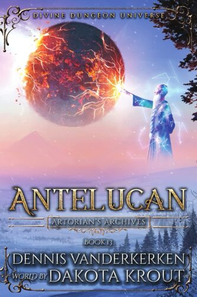
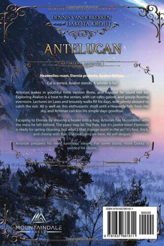
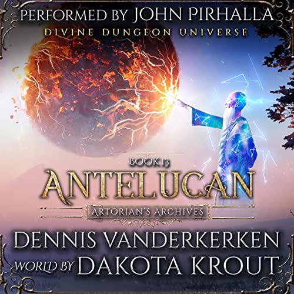

# Antelucan
---
book blurb / description

## Characters

### Main Characters
- [Artorian](../../_Characters/ArtoriansArchives/Artorian.md)
- [Ember](../../_Characters/ArtoriansArchives/Ember.md)

### Supporting Characters
-  Shaka

## Book Info

| General Info |  |
|---|---|
| Author| [Dennis Vanderkerken](../../_Lexicon/DennisVanderkerken.md) |
| Narrator| [John Pirhalla](../../_Lexicon/JohnPirhalla.md) |
| Publisher |[Mountaindale Press](../../_Lexicon/MountaindalePress.md) |
| |  |

| Book Info |  |
|---|---|
| Series | [Artorians Archives](../ArtoriansArchives/ArtoriansArchives.md) |
| Book Number | book 13 |
| Pages | 474 pages |
| Audio Duration| 14 hours 6 minutes |

| Previous Book | Following Book |
|---|---|
| [Avalon](Avalon.md) | [AA14](../ArtoriansArchives/AA14.md) |

## Publication Information

| Format | Published | ASIN / ISBN |
|---|---|---|
| Ebook | January 11, 2023 | B0BL57PVHX |
| Audiobook | January 11, 2023 | B0BPTG2CPS |
| Paperback | January 11, 2023 | 978-1637661611 |

| Front Cover                                                                      | Back Cover                                                                               | Audiobook Cover |
| -------------------------------------------------------------------------------- | ---------------------------------------------------------------------------------------- | --------------- |
|  |  |                 |

## Chapter Summaries
1. A Child sized [Artorian](../../_Characters/ArtoriansArchives/Artorian.md) wakes up in [Avalon](../../_Atlas/ArtoriansArchives/Avalon.md), and after getting his feet back under him he flirts with and through a diplay of public affection, embarrasses an equally smol [Ember](../../_Characters/ArtoriansArchives/Ember.md).
2. Lots of gossiping about the Cute Couple, and an overview of how Avalon is working.
3. Young-torian and [Ember](../../_Characters/ArtoriansArchives/Ember.md) head to the [Crème de la Crème à la Edgar](../../_Atlas/ArtoriansArchives/CrèmedelaCrèmeàlaEdgar.md) and Ember gives Artorian his [SilverwoodBracelet](../../_Lexicon/SilverwoodBracelet.md). 
4. [Shaka](../../_Characters/ArtoriansArchives/Shaka.md) Shows up as Artorians eats his puzzling noodles, and he shares the nodes of the first tier on the tower.
5. Explanation of Tower Tiers two through ten.
6. Explanation of Tower Tiers eleven through fifteen.
7. We meet the [MFBT](../../_Lexicon/MFBT.md) and Kronk.
8. The layout of Avalon is explained and Ember's Master plan is revealed.