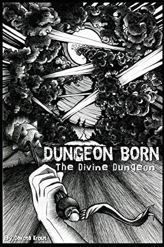
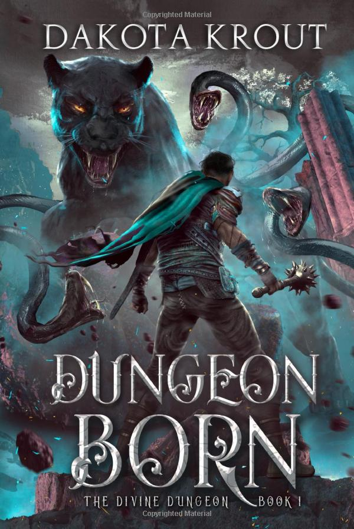

# Dungeon Born
---
**A powerful dungeon. A sheep-herder turned Noble. Their path to ascendance through cultivation.**

Conquering dungeons and using them to grow has long been the most efficient way to become a powerful adventurer. The only thing keeping the process from being easy is the Beasts that inhabit these places. Questions plague those entering this particular place of power: Where do the ‘rewards’ of weapons, armor, and heavy gold coins come from? Why is a fluffy bunny charging at me? For abyss-sake, why are there so many monsters?

[Cal](../../_Characters/DivineDungeon/Cal.md) has all of the answers to these age-old questions for a very simple reason. He is a [Dungeon Core](../../_Lexicon/DungeonCore.md), a soul forced against his will into a magical stone. With the help of an energetic friend, [Cal](../../_Characters/DivineDungeon/Cal.md) grows a dungeon around himself to bring in new sources of power.

When a threat he doesn’t fully comprehend bares its many teeth, Cal is determined to survive the attempt on his life. Unfortunately for adventurers, the only way for him to achieve his goal is to eat anyone that enters his depths.

## Characters

#### Main Characters

- [Cal](../../_Characters/DivineDungeon/Cal.md)
- [Dale](../../_Characters/DivineDungeon/Dale.md)

#### Supporting Characters
- [Dani](../../_Characters/DivineDungeon/Dani.md)
- [Tim](../../_Characters/DivineDungeon/Tim.md)
- [Kantor](../../_Characters/DivineDungeon/Kantor.md)

## Book Info

| General Info |  |
|---|---|
| Author| [Dakota Krout](../../_Lexicon/DakotaKrout.md) |
| Narrator| [Vikas Adam](../../_Lexicon/VikasAdam.md) |
| Publisher | Mountaindale Press |
| | Tantor Audio |

| Book Info |  |
|---|---|
| Series | [Divine Dungeon](DivineDungeon.md) |
| Book Number | book 1 |
| Pages | 401 pages |
| Audio Duration| 12 hours 32 minutes |

| Previous Book | Following Book |
|---|---|
| N/A | [Dungeon Madness](DungeonMadness.md)|

## Publication Information

| Format | Published | ASIN / ISBN |
|---|---|---|
| Ebook (1st Edition) | October 9, 2016 | B07RR97GXF |
| Ebook (2nd Edition) | May 9, 2019 | B07RR97GXF |
| Audiobook | March 28, 2019 | B06XQ44QVK |
| Audio CD | March 1, 2021 | 978-1665274364 |
| Hardcover | January 17, 2022 | 978-1637660492 |
| Paperback | May 22, 2019 | 978-1950914050 |

### First Edition Covers

| Front Cover | Back Cover | Audiobook Cover |
|---|---|---|
|  |   |  |

### Second Edition Covers

| Front Cover | Back Cover | Audiobook Cover |
|---|---|---|
|  |  |  |

## Chapter Summaries
0. The creation and death of [Cal](../../_Characters/DivineDungeon/Cal.md) at the hands of Necromancers
1. Cal's influence spreads as his puddle gets filled with rain, and he discovers [Moss](../../_Lexicon/Moss.md) and promptly kills the first patch he can touch. Cal meets [Kantor](../../_Characters/DivineDungeon/Kantor.md), a fellow [Dungeon Core](../../_Lexicon/DungeonCore.md)
2. Cal meets [Dani](../../_Characters/DivineDungeon/Dani.md) and she gives Cal his name. Cal learns how to use his [Essence](../../_Lexicon/Essence.md) and begins to expand his [Influence](../../_Lexicon/Influence.md). Cal Creates a [[../../_Bestiary/Shroomish]]