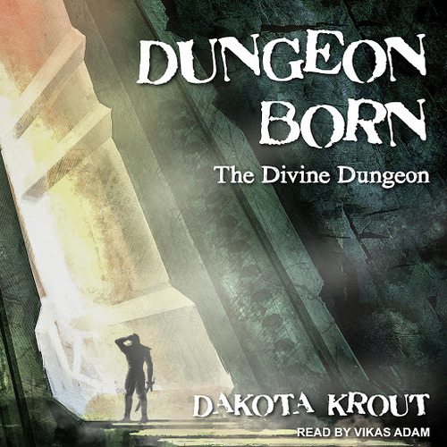
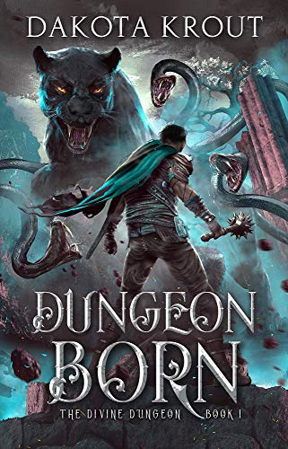
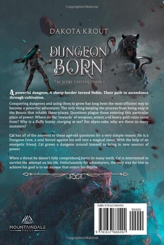
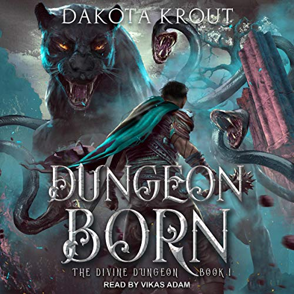

# Dungeon Born
---
**A powerful dungeon. A sheep-herder turned Noble. Their path to ascendance through cultivation.**
webbk18#7704
Conquering dungeons and using them to grow has long been the most efficient way to become a powerful adventurer. The only thing keeping the process from being easy is the Beasts that inhabit these places. Questions plague those entering this particular place of power: Where do the ‘rewards’ of weapons, armor, and heavy gold coins come from? Why is a fluffy bunny charging at me? For abyss-sake, why are there so many monsters?

[Cal](../../_Characters/DivineDungeon/Cal.md) has all of the answers to these age-old questions for a very simple reason. He is a [Dungeon Core](../../_Lexicon/DungeonCore.md), a soul forced against his will into a magical stone. With the help of an energetic friend, [Cal](../../_Characters/DivineDungeon/Cal.md) grows a dungeon around himself to bring in new sources of power.

When a threat he doesn’t fully comprehend bares its many teeth, Cal is determined to survive the attempt on his life. Unfortunately for adventurers, the only way for him to achieve his goal is to eat anyone that enters his depths.

## Characters

#### Main Characters
- [Cal](../../_Characters/DivineDungeon/Cal.md)
- [Dale](../../_Characters/DivineDungeon/Dale.md)
- [Dani](../../_Characters/DivineDungeon/Dani.md)

#### Supporting Characters

- [Kantor](../../_Characters/DivineDungeon/Kantor.md)
- Sheepherders
	- Swarthy Man
	- [Tim](../../_Characters/DivineDungeon/Tim.md)
	- Angry Bearded Man
	- Fourth Man
	- Guy who falls into the pit
-  Guild Scouting Party
	- Elf
	- Priest
	- Human 2 
	- Human 3
- [Father Richard](../../_Characters/DivineDungeon/FatherRichard.md)
- [Guild Leader Frank](../../_Characters/DivineDungeon/Frank.md)

## Book Info

| General Info |  |
|---|---|
| Author| [Dakota Krout](../../_Lexicon/DakotaKrout.md) |
| Narrator| [Vikas Adam](../../_Lexicon/VikasAdam.md) |
| Publisher | Mountaindale Press |
| | Tantor Audio |

| Book Info |  |
|---|---|
| Series | [Divine Dungeon](DivineDungeon.md) |
| Book Number | book 1 |
| Pages | 401 pages |
| Audio Duration| 12 hours 32 minutes |

| Previous Book | Following Book |
|---|---|
| N/A | [Dungeon Madness](DungeonMadness.md)|

## Publication Information

| Format | Published | ASIN / ISBN |
|---|---|---|
| Ebook (1st Edition) | October 9, 2016 | B07RR97GXF |
| Ebook (2nd Edition) | May 9, 2019 | B07RR97GXF |
| Audiobook | March 28, 2019 | B06XQ44QVK |
| Audio CD | March 1, 2021 | 978-1665274364 |
| Hardcover | January 17, 2022 | 978-1637660492 |
| Paperback | May 22, 2019 | 978-1950914050 |

### First Edition Covers

| Front Cover | Back Cover | Audiobook Cover |
|---|---|---|
|  |   |  |

### Second Edition Covers

| Front Cover | Back Cover | Audiobook Cover |
|---|---|---|
|  |  |  |

## Chapter Summaries
Prologue: The creation and death of [Cal](../../_Characters/DivineDungeon/Cal.md) at the hands of Necromancers
1. Cal's influence spreads as his puddle gets filled with rain, and he discovers [Moss](../../_Lexicon/Moss.md) and promptly kills the first patch he can touch. Cal meets [Kantor](../../_Characters/DivineDungeon/Kantor.md), a fellow [Dungeon Core](../../_Lexicon/DungeonCore.md)
2. Cal meets [Dani](../../_Characters/DivineDungeon/Dani.md) and she gives Cal his name. Cal learns how to use his [Essence](../../_Lexicon/Essence.md) and begins to expand his [Influence](../../_Lexicon/Influence.md). Cal Creates a [Shroomish](../../_Bestiary/DD/Shroomish.md), and expands his essence to the mouth of the cave
3. Cal makes his first [Dungeon Born](../../_Lexicon/DungeonBornC.md) Creatures, some more mushrooms. Dani teaches him how to expand his dungeon, and teaches him about black and white dungeon cores.
4. Cal rapidly expands his dungeon while Dani is looking for herbs, causing chaos on the surface. Dani comes back with a [Silverwood Tree](../../_Lexicon/SilverwoodTree.md) Seed.  Cal makes his dungeon more dangerous adding traps and making the mushrooms and moss more dangerous.
5. A Sheepherder party of five stumbles upon Cal's dungeon. An unnamed guy is the first casualty when he falls into a pit (pg 57). The Fourth Man is the second casualty getting eaten by [Dire Shroom](../../_Bestiary/DD/DireShroom.md) Bane (pg 60). Next to die is the swarthy man when he inhales spores and then stumbles and gets a spike through the skull (pg 60).
6. Cal Learns how to make his [Chi Spiral](../../_Lexicon/ChiSpiral.md) and learns more about essence. He discovers that one of his moss patches has developed the [Vampirism](../../_Lexicon/Vampirism.md) effect and he Creates a Moss-Mushroom Hybrid with that effect as his new boss, a [Dire Shroomish](../../_Bestiary/DD/DireShroomish.md).
7. Dale returns home, sells everything he has and buys the land the dungeon is on, and calls in the [Adventurers Guild](../../_Characters/DivineDungeon/AdventurersGuild.md). The four Guild members travel up to the dungeon lead by [Dale](../../_Characters/DivineDungeon/Dale.md) and the Guild members quickly clear the dungeon and the Elf identifies the [Silverwood Tree](../../_Lexicon/SilverwoodTree.md) in the boss room, and cast protective magic over the tree.
8. Cal and Dani Freak out when the Guild shows up and are way higher level. Dani tells Cal A little bit about [Aura](../../_Lexicon/Aura.md) and Cal tells Dani that he was a Human, which is why He can use all essence types.
9. Cal Grumpily resets his dungeon plants and mobs while Dani goes out and gets Flower seeds and some Herbs, which get rid of Cal's Dead body odor. Cal gets attacked by a [Mountain Bunny](../../_Bestiary/DD/MountainBunny.md). 
10. After a couple weeks of travel the four Adventurers Guild members reached a city and Spread the news of the dungeon. They each go to their respective leaders who all want to be first to establish claim over the dungeon.
	- After a couple weeks of travel the four Adventurers Guild members reached a city and Spread the news of the dungeon. They each go to their respective leaders who all want to be first to establish claim over the dungeon. They go to the Elven Embassy almost causing a riot when the Silverwood tree was learned of. The elves prepared [Memory Stones](../../_Lexicon/MemoryStone.md) and sent several messengers to the Eleven Capital with plans to build a city at the Dungeon. The Group splits from there. The Priest goes to the Church where the Bishop inspects and prays over the pendant from the dungeon, which fills with a lot of Celestial Essence. The Bishop then says they must build a Church at the Dungeon and orders the Priest find [Father Richard](../../_Characters/DivineDungeon/FatherRichard.md). The Local Guild Leader, [Frank](../../_Characters/DivineDungeon/Frank.md) hears of the Dungeon passing it off then learns of the Silverwood Tree. He declares that the Adventurers Guild must make it to the dungeon first. [Frank](../../_Characters/DivineDungeon/Frank.md) sets preparations in motion to take the mountain.
11. Cal uses his new knowledge of Bunnies to create a breeding pair of two males. Dani lures a female in and Cal creates a few copies. [Dale](../../_Characters/DivineDungeon/Dale.md) and [Frank](../../_Characters/DivineDungeon/Frank.md) discuss [payment](../../_Lexicon/GuildDeal.md) and Frank suggests getting Dale equipped and trained. Cal has continued to improve the dungeon and expand his [Dungeon Born](DungeonBorn.md) rabbit population of [Bashers](../../_Bestiary/DD/Basher.md). Dale gets his armor and weapon, a Morning Star at a cost of one Platinum, thirty gold, forty silver and six copper, and starts training with [Craig](../../_Characters/DivineDungeon/Craig.md), who jumpstarts Dale's [Cultivation](../../_Lexicon/Cultivation.md).
12. Dale and a couple C-Rankers enter the dungeon and make it to the boss room and defeat the [Bloody Bane](../../_Bestiary/DD/BloodyBane.md). Dale gets his essence and corruption ripped out of him by a [BeastCore](../../_Lexicon/BeastCore.md). With [Craig](../../_Characters/DivineDungeon/Craig.md)'s assistance Dale develops his Chi Spiral.
13. Cal learns how to make a beast core from the one Dale's Party Discarded and begins making his Essence assumulators. Dale gets a quest from the Chef to get herbs from the Dungeon, and Craig puts Dale in the front of the group this time. They clear the dungeon and spend some time [Cultivating](../../_Lexicon/Cultivation.md) before leaving again. A couple more groups come through and Cal acquires new armor and weapons as well as knowledge about healing.
14. Dale meets [Father Richard](../../_Characters/DivineDungeon/FatherRichard.md) who takes some land to build a church on. Cal reaches a new Rank and expands the dungeon and adds new mobs and bosses.

