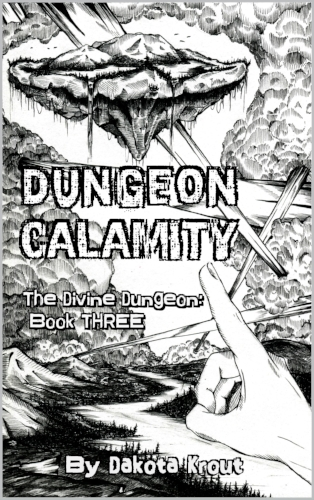
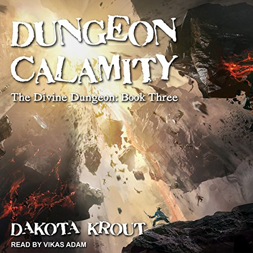
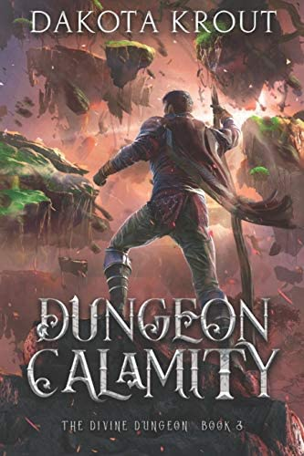
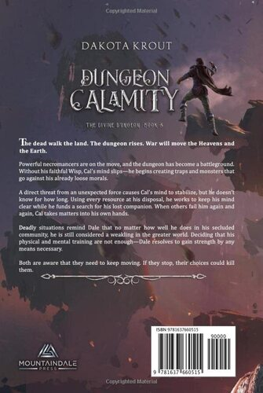
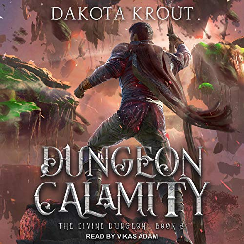

# Dungeon Calamity
---
**The dead walk the land. The dungeon rises. War will move the Heavens and the Earth.**

Powerful necromancers are on the move, and the dungeon has become a battleground. Without his faithful Wisp, [Cal's](../../_Characters/DivineDungeon/Cal.md) mind slips—he begins creating traps and monsters that go against his already loose morals.

A direct threat from an unexpected force causes Cal's mind to stabilize, but he doesn’t know for how long. Using every resource at his disposal, he works to keep his mind clear while he funds a search for his lost companion. When others fail him again and again, Cal takes matters into his own hands.

Deadly situations remind [Dale](../../_Characters/DivineDungeon/Dale.md) that no matter how well he does in his secluded community, he is still considered a weakling in the greater world. Deciding that his physical and mental training are not enough—Dale resolves to gain strength by any means necessary.

Both are aware that they need to keep moving. If they stop, their choices could kill them.

## Characters

### Main Characters
-   

### Supporting Characters
-  

## Book Info

| General Info |  |
|---|---|
| Author| [Dakota Krout](../../_Lexicon/DakotaKrout.md) |
| Narrator| [Vikas Adam](../../_Lexicon/VikasAdam.md) |
| Publisher | Mountaindale Press |
| | Tantor Audio |

| Book Info |  |
|---|---|
| Series | Divine Dungeon |
| Book Number | book 3 |
| Pages | 432 pages |
| Audio Duration| 13 hours 12 minutes |

| Previous Book | Following Book |
|---|---|
| [Dungeon Madness](DungeonMadness.md) | [Dungeon Desolation](DungeonDesolation.md) |

## Publication Information

| Format | Published | ASIN / ISBN |
|---|---|---|
| Ebook (1st Edition) | February 15, 2017 | B07RTHDP7T |
| Ebook (2nd Edition) | May 9, 2019 | B07RTHDP7T |
| Audiobook | January 25, 2018| B0799RB2HB |
| Hardcover | January 17, 2022 | 978-1637660515 |
| Paperback | May 22, 2019 | 978-1950914074 |

### First Edition Covers

| Front Cover | Back Cover | Audiobook Cover |
|---|---|---|
|  |   | 
### Second Edition Covers

| Front Cover | Back Cover | Audiobook Cover |
|---|---|---|
|  |  | 

## Chapter Summaries
1. 