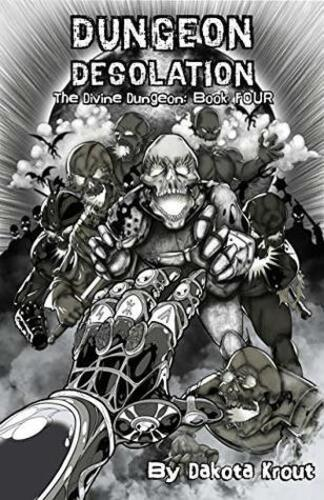
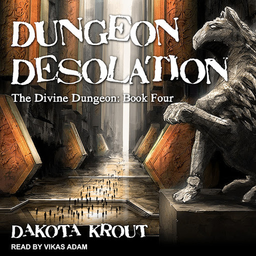
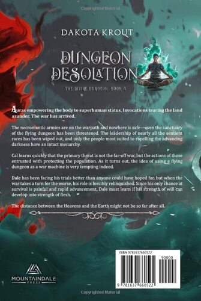
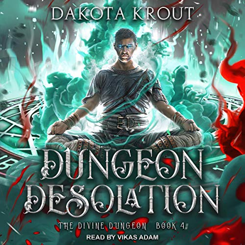

# Dungeon Desolation
---
**Auras empowering the body to superhuman status. Invocations tearing the land asunder. The war has arrived.**

The necromantic armies are on the warpath and nowhere is safe—even the sanctuary of the flying dungeon has been threatened. The leadership of nearly all the sentient races has been wiped out, and only the people most suited to repelling the advancing darkness have an intact monarchy.

[Cal](../../_Characters/DivineDungeon/Cal.md) learns quickly that the primary threat is not the far-off war, but the actions of those entrusted with protecting the population. As it turns out, the idea of using a flying dungeon as a war machine is very tempting indeed.

[Dale](../../_Characters/DivineDungeon/Dale.md) has been facing his trials better than anyone could have hoped for, but when the war takes a turn for the worse, his role is forcibly relinquished. Since his only chance at survival is painful and rapid advancement, [Dale](../../_Characters/DivineDungeon/Dale.md) must learn if his strength of will can develop into strength of flesh.

The distance between the Heavens and the Earth might not be so far after all.

## Characters

### Main Characters
-   

### Supporting Characters
-  

## Book Info

| General Info |  |
|---|---|
| Author| [Dakota Krout](../../_Lexicon/DakotaKrout.md) |
| Narrator| [Vikas Adam](../../_Lexicon/VikasAdam.md) |
| Publisher | Mountaindale Press |
| | Tantor Audio |

| Book Info |  |
|---|---|
| Series | Divine Dungeon |
| Book Number | book 4 |
| Pages | 400 pages |
| Audio Duration| 11 hours 55 minutes |

| Previous Book | Following Book |
|---|---|
| [Dungeon Calamity](DungeonCalamity.md) | [Dungeon Eternium](DungeonEternium.md) |

## Publication Information

| Format | Published | ASIN / ISBN |
|---|---|---|
| Ebook (1st Edition) | November 2, 2018 | B07RVJYX32 |
| Ebook (2nd Edition) | May 9, 2019 | B07RVJYX32 |
| Audiobook | January 22, 2019 | B07MVJ4FTF |
| Hardcover | January 17, 2022 | 978-1637660522 |
| Paperback | May 22, 2019 | 978-1950914081 |

### First Edition Covers

| Front Cover | Back Cover | Audiobook Cover |
|---|---|---|
|  |   | 

### Second Edition Covers

| Front Cover | Back Cover | Audiobook Cover |
|---|---|---|
|  |  |  |

## Chapter Summaries
1. 