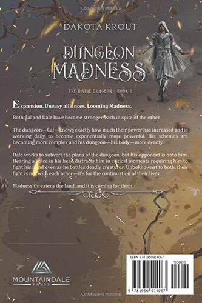

# Dungeon Madness
---
**Expansion. Uneasy alliances. Looming Madness.**

Both [Cal](../../_Characters/DivineDungeon/Cal.md) and [Dale](../../_Characters/DivineDungeon/Dale.md) have become stronger, each in spite of the other.

The dungeon—Cal—knows exactly how much their power has increased and is working daily to become exponentially more powerful. His schemes are becoming more complex and his dungeon—his body—more deadly.

Dale works to subvert the plans of the dungeon, but his opponent is onto him. Hearing a voice in his head distracts him in critical moments requiring him to fight his mind even as he battles deadly creatures. Unbeknownst to both, their fight is not with each other—it’s for the continuation of their lives.

Madness threatens the land, and it is coming for them

## Characters

### Main Characters
- [Cal](../../_Characters/DivineDungeon/Cal.md)
- [Dale](../../_Characters/DivineDungeon/Dale.md)
- [Dani](../../_Characters/DivineDungeon/Dani.md)

### Supporting Characters
-  

## Book Info

| General Info |  |
|---|---|
| Author| [Dakota Krout](../../_Lexicon/DakotaKrout.md) |
| Narrator| [Vikas Adam](../../_Lexicon/VikasAdam.md) |
| Publisher | Mountaindale Press |
| | Tantor Audio |

| Book Info |  |
|---|---|
| Series | [Divine Dungeon](DivineDungeon.md) |
| Book Number | book 2 |
| Pages | 424 pages |
| Audio Duration| 12 hours 1 minutes |

| Previous Book | Following Book |
|---|---|
| [Dungeon Born](DungeonBorn.md) | [Dungeon Calamity](DungeonCalamity.md) |

## Publication Information

| Format | Published | ASIN / ISBN |
|---|---|---|
| Ebook (1st Edition) | February 15, 2017 | B07RP69LFQ |
| Ebook (2nd Edition) | May 9, 2019 | B07RP69LFQ |
| Audiobook | October 17, 2017 | B0764H4BGT |
| Hardcover | January 17, 2022 | 978-1637660508 |
| Paperback | May 22, 2019 | 978-1950914067 |

### First Edition Covers

| Front Cover | Back Cover | Audiobook Cover |
|---|---|---|
|  |   | 

### Second Edition Covers

| Front Cover | Back Cover | Audiobook Cover |
|---|---|---|
|  |  | 

## Quotes
- 

## Chapter Summaries
**Prologue** - 
1. 