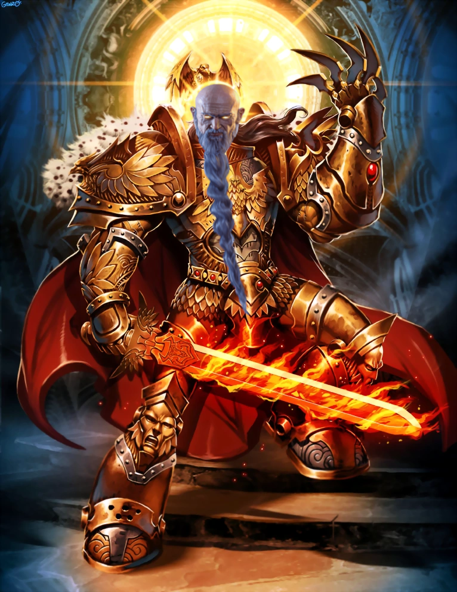

# Artorian
---

The main character of the Artorian's Archives series. He cares a lot for those he takes care of and causes mischief everywhere he goes.

**Divine Dungeon** appendix entry: The new Headmaster of the Academy. He made a deal with the dungeon to swiftly advance to the Mage ranks.

**Artorian's Archives** appendix entry: The main character of the series. If you weren’t expecting shenanigans, grab some popcorn. It only gets more intense from here on. He’s a little flighty, deeply interested, and a miser of mischief. He is referred to by the Wood Elves as Starlight Spirit.

Blue Eyes (Chp 3 [Antelucan](../../_Books/ArtoriansArchives/Antelucan.md))
Pink Eyes (Chp 11 [Antelucan](../../_Books/References/Antelucan.md))
## Aliases
- Sunny
- Tsu
- Administrator, 
- Dreamer
- Elder
- Headmaster
- Hephaestus
- Loki
- Merly
- Longbeard
- Old Man Sunny
- Starlight Spirit
- The Old Coot with a Plan
- Arty
- Grandpa
- Bunny Boy
- Smol-Torian
- Young-torian

